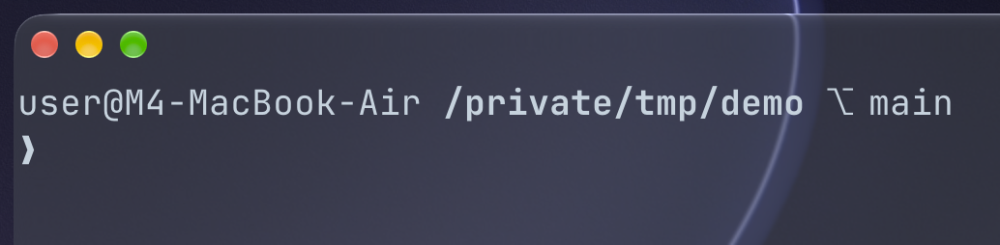
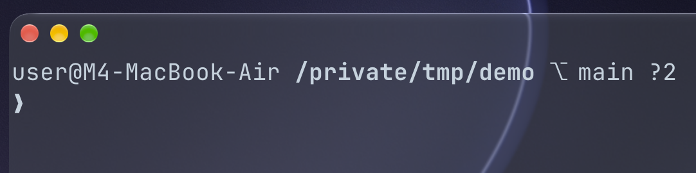
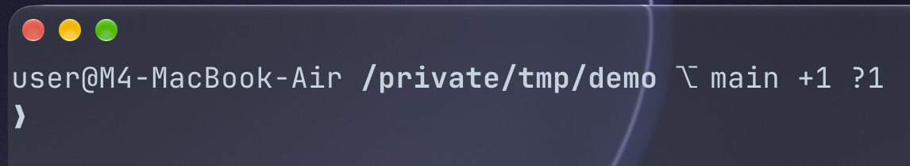
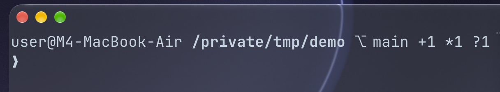
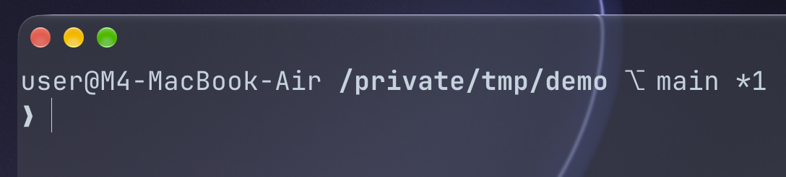
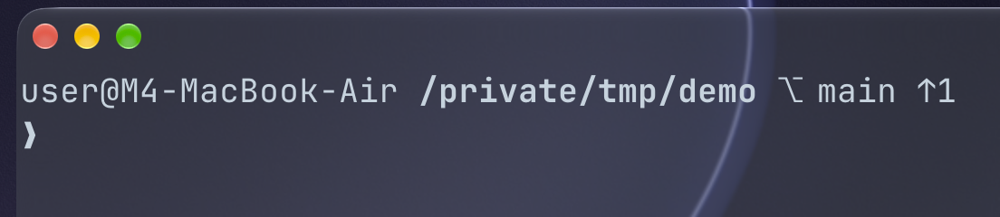
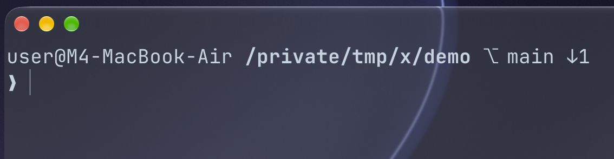

`zsh` includes a native function for extracting a repository's version control data, so there is no need to rely on external plugins, you simply need to register the function to lazy load with `autoload -Uz vcs_info`

You use `zstyle` to customize how the `vcs_info` formats the data, which is ultimately substituted into your command prompt. `precmd` is responsible for running the function every time you enter a command (data is extracted and information is updated before your command executes).

While you can use the default arrays for staged/unstaged and committed/uncommitted changes, we can declare (must start with `+vi-`) a custom function which is registered as a `vcs_info` hook (not a `zsh` hook). This also allows us to show tracked/untracked files which is not native to `vcs_info`.

All of the shell scripting is within a dummy [`.zshrc`](.zshrc), which is where you should put things for interactive shell environments.

Showcase:

A clean repository:

    

2 untracked files:

    

1 staged file and 1 untracked file:

    

1 staged, 1 unstaged, and 1 untracked file:

    

1 unstaged file:

    

Ahead the remote by 1 commit:

    

Behind the remote by 1 commit:

    

You can read more about `vcs_info` in the [official documentation](https://zsh.sourceforge.io/Doc/Release/User-Contributions.html#Version-Control-Information).
